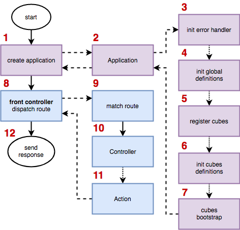

# Архитектура

## Структура приложения

```
config/ - конфигурационные файлы
cubes/ - кубы компонентов
    content/ - директория (пространство) контентных кубов
        article/ - куб статей
        ... - прочие кубы пространства
    multilang/ - директория кубов по работе с мультиязычностью
    system/ - директория системных кубов
guide/ - данная документация
modules/ - кубы глобальных модулей *
    admin/ - куб Web Complete CMS
    pub/ - куб публичной части
runtime/ - временные файлы - кэш, логи итд.
storage/ - постоянное файловое хранилище
tests/ - юнит-тесты
vendor/ - библиотеки composer
web/ - document root
```

\* Глобальный модуль - имеет исключительно логическое разделение. Как правило, подразумевается, что это такие кубы, как:
- admin
- public
- api

итд.

## Жизненный цикл приложения

Приложение имеет единую точку входа и обрабатывается FrontController-ом:


Детальный цикл приложения:



1. index.php. Создание приложения
1. Application. Конструктор класса, инициализация конфига (**WebComplete\mvc\Application**)
3. Application. Инициализация обработчика ошибок
4. Application. Инициализация глобальных зависимостей (из config/definitions.php)
5. Application. Рекурсивная загрузка кубов из путей, указанных в конфиге (config -> cubesLocations)
6. Application. Инициализация зависимостей кубов
7. Application. Bootstrap кубов
8. Вызов Front Controller-а (**WebComplete\mvc\front\FrontController**)
9. Определение контроллера маршрута (**WebComplete\mvc\router\Router**)
10. Выполнение контроллера
11. Выполнение действия (beforeAction - action - afterAction)
12. Отправка ответа из controller/action (**WebComplete\mvc\front\FrontController**, index.php)

Далее: [Установка](installation.md)<br>
Вверх: [Оглавление](index.md)
