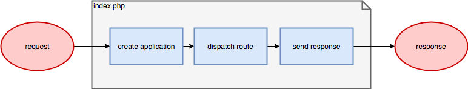

# Архитектура

## Структура приложения

```
config/ - конфигурационные файлы
cubes/ - кубы компонентов
    content/ - пространство контентных кубов
        article/ - куб статей
        ... - прочие кубы пространства
    multilang/ - пространство кубов мультиязычности
    system/ - пространство системных кубов
guide/ - данная документация
modules/ - кубы глобальных модулей
    admin/ - куб Web Complete CMS
    pub/ - куб публичной части
runtime/ - временные файлы - кэш, логи итд.
storage/ - постоянное файловое хранилище
tests/ - юнит-тесты
vendor/ - библиотеки composer
web/ - document root
```

## Жизненный цикл приложения



Далее: [Установка](installation.md)<br>
Вверх: [Оглавление](index.md)
